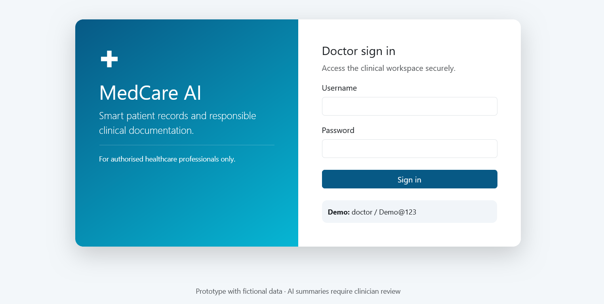
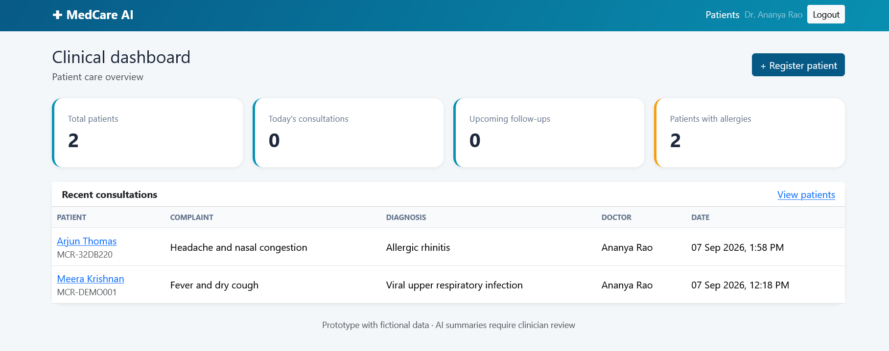
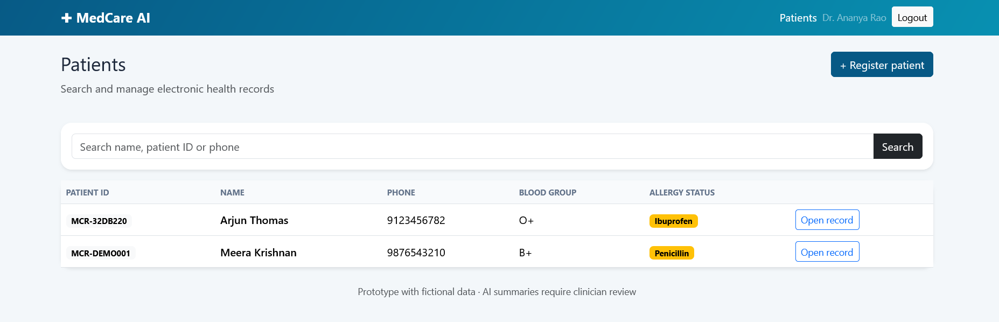
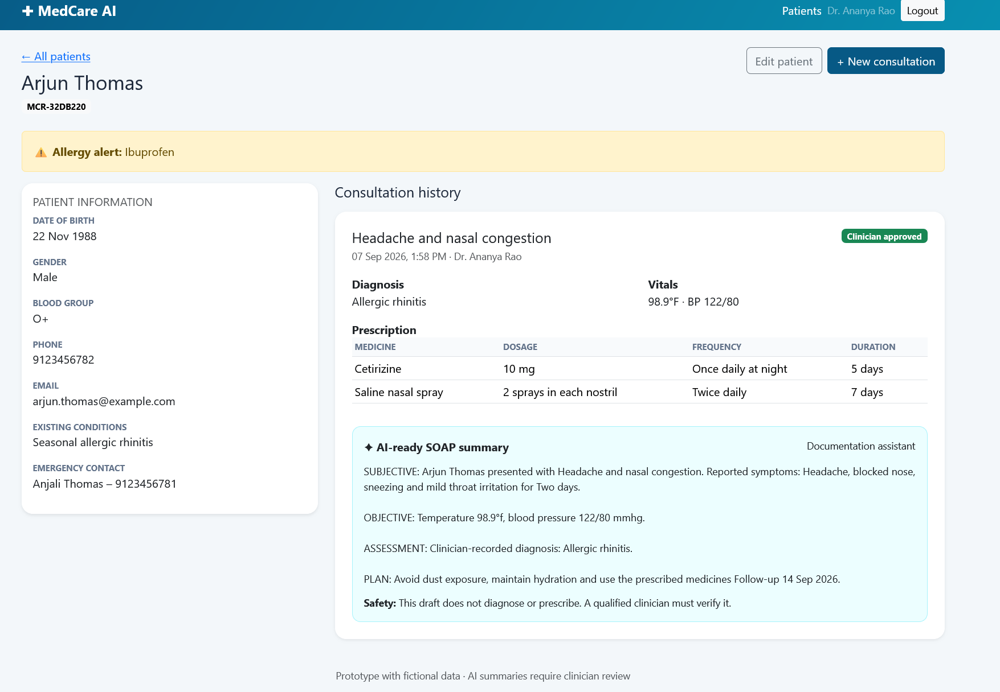

# MedCare AI

## Mini Electronic Health Record & Clinical Documentation Assistant

MedCare AI is a Django-based mini Electronic Health Record (EHR) application that helps authenticated healthcare professionals register patients, maintain consultation history, manage prescriptions, identify possible medicine–allergy conflicts, and generate structured SOAP summaries.

The project demonstrates full-stack Django development and responsible AI-assisted clinical documentation. It is an educational prototype built with fictional data and is not intended for real medical use.

Application Preview

Doctor Login

Clinical Dashboard

Patient Directory

SOAP Summary

# Problem Addressed

Clinical information may be distributed across paper records, separate consultation notes, and prescriptions. This can make it difficult to review a patient’s medical history, track follow-ups, and identify recorded allergies during a consultation.

MedCare AI brings these details into a structured patient record and provides an AI-ready documentation workflow while keeping the doctor responsible for every clinical decision.

# Key Features

Secure doctor login using Django Authentication
Clinical dashboard with important record counts
Patient registration and profile editing
Search by patient name, patient ID, or phone number
Longitudinal consultation history
Symptoms, vital signs, diagnosis, notes, and treatment plan
Multiple prescriptions for each consultation
Structured SOAP summary generation
Basic medicine–allergy conflict warning
Doctor-review and approval status
Responsive Bootstrap interface
Django Admin for record and user management
Automated backend tests
Fictional demonstration dataset
How the Application Works
An authorised doctor signs in.
The doctor searches for an existing patient or registers a new patient.
A consultation is recorded with symptoms, vital signs, diagnosis, clinical notes, and a treatment plan.
The backend converts the structured consultation fields into a SOAP-format summary.
The doctor adds one or more prescriptions.
The system compares prescribed medicine names with recorded allergies and displays a warning when a possible match is found.
The consultation becomes part of the patient’s longitudinal record.

# SOAP Documentation Assistant

SOAP represents:

# Subjective
Chief complaint, symptoms, and duration

# Objective
Recorded temperature and blood pressure

# Assessment
Clinician-entered diagnosis

# Plan
Treatment plan and follow-up date

The present version uses deterministic Python logic rather than an external AI API. This provides predictable output, works without an internet connection, and avoids transferring patient information to a third-party service.

The summarisation logic is isolated in a service layer, allowing it to be replaced later with an approved and clinically evaluated language model.

The assistant does not independently diagnose conditions or prescribe medicines. Generated documentation must be reviewed by a qualified healthcare professional.
